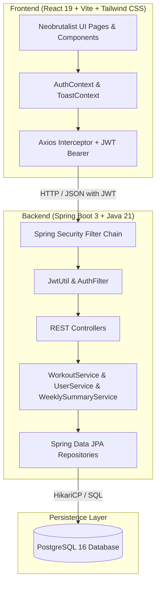

# Momentum Fitness Tracker

```text
⠀⠀⠀⠀⠀⠀⠀⠀⠀⠀⠀⠀⠀⠀⠀⠀⠀⠀⠀⠀⠀⠀⠀⠀⠀⠀⠀⠀⠀⠀⠀⣀⣠⣄⣀⣀⠀⠀⠀⠀⠀⠀⠀⠀⠀⠀⠀⠀⠀⠀⠀
⠀⠀⠀⠀⠀⠀⠀⠀⠀⠀⠀⠀⠀⠀⠀⠀⠀⠀⠀⠀⠀⠀⠀⠀⠀⠀⠀⠀⣠⣶⠿⠛⠉⠉⠉⠙⠻⣶⣄⠀⠀⠀⠀⠀⠀⠀⠀⠀⠀⠀⠀
⠀⠀⠀⠀⠀⠀⠀⠀⠀⠀⠀⠀⠀⠀⠀⠀⣀⣤⣶⠶⠿⠛⠛⠷⢶⣤⣤⡾⠋⠀⠀⠀⠀⠀⠀⠀⠀⠈⠹⣷⡀⠀⠀⠀⠀⠀⠀⠀⠀⠀⠀
⠀⠀⣠⣴⡶⠾⠿⠛⠛⠛⠛⠛⠻⢶⣶⡿⠛⠉⠀⠀⠀⠀⠀⠀⠀⢨⣿⠃⠀⠀⠀⠀⠀⠀⠀⠀⠀⠀⠀⠈⢿⣄⠀⠀⠀⠀⠀⠀⠀⠀⠀
⢠⣾⠋⠁⠀⠀⠀⠀⠀⠀⠀⠀⠀⣿⠋⠀⠀⠀⠀⠀⠀⠀⠀⠀⠀⠘⠃⠀⠀⠀⠀⠀⠀⠀⠀⠀⠀⠀⠀⠀⠈⢿⡄⠀⠀⠀⠀⠀⠀⠀⠀
⣼⠇⠀⠀⠀⠀⠀⠀⠀⠀⠀⠀⠀⠀⠀⠀⠀⠀⠀⠀⠀⠀⠀⠀⠀⠀⠀⠀⠀⠀⠀⠀⠀⠀⠀⠀⠀⠀⠀⠀⠀⠘⣧⠀⠀⠀⠀⠀⠀⠀⠀
⣿⠀⠀⠀⠀⠀⠀⠀⠀⠀⠀⠀⠀⠀⠀⠀⠀⠀⠀⠀⠀⠀⠀⠀⠀⠀⠀⠀⠀⠀⠀⠀⠀⠀⠀⠀⠀⡰⢱⠀⠀⠀⢹⡆⠀⠀⠀⠀⠀⠀⠀
⢹⡆⠀⠀⠀⠀⠀⠀⠀⠀⠀⠀⠀⠀⠀⠀⠀⠀⠀⠀⠀⠀⠀⠀⠀⠀⠀⠀⠀⠀⠀⠀⠀⠀⠀⠀⠀⡇⠸⠇⠀⠀⢸⡇⠀⠀⠀⠀⠀⠀⠀
⠘⣿⡀⠀⠀⠀⠀⠀⠀⠀⠀⠀⠀⠀⠀⠀⠀⠀⠀⠀⠀⠀⠀⠀⠀⠀⠀⠀⠀⠀⠀⠀⠀⠀⠀⠀⠀⠀⠀⠀⠀⠀⣸⠃⠀⠀⠀⠀⠀⠀⠀
⠀⠘⣷⡀⠀⡎⢢⠀⠀⠀⠀⠀⠀⠀⠀⠀⠀⠀⠀⠀⠀⠀⠀⠀⠀⠀⠀⠀⠀⠀⠀⠀⠀⠀⠀⠀⠀⠀⠀⠀⠀⠀⠿⠀⠀⠀⠀⠤⠀⠀⠀
⠀⠀⠘⢿⣄⠈⠺⠀⠀⠀⣀⡀⠀⠀⠀⠀⠀⠀⠀⠀⠀⠀⠀⠀⠀⠀⠀⠀⠀⠀⠀⠀⠀⠀⢀⣠⣴⣶⡦⠀⠀⠀⠻⠶⡦⠀⠀⠀⠀⠀⠀
⠀⠀⠀⠀⠻⠦⠀⠀⠀⣾⡍⣧⠀⠀⠀⠀⠀⠀⠀⠀⠀⠀⠀⠀⠀⠀⠀⠀⠀⠀⠀⠀⣠⣾⡿⠛⠉⠉⠀⠀⠀⠀⠛⠛⠀⠀⠀⠀⠀⠀⠀
⠀⠀⠀⠀⠐⠶⠒⠀⠀⣿⣿⣿⡆⠀⠀⠀⠀⠀⠀⠀⣀⠀⠀⣠⠀⠀⢰⣤⠀⠀⠀⠀⠙⠿⣦⣄⠀⠀⠀⠀⠀⠀⣘⠷⠀⠀⠀⠀⠀⠀⠀
⠀⠀⠀⠀⢰⣾⣿⠀⠀⢻⣿⣿⣷⠀⠀⠀⠀⠀⠀⠀⢿⣥⣴⡿⠷⣶⠾⠃⠀⠀⠀⠀⠀⠀⠈⠙⢿⣦⠂⣷⠄⣠⡟⠗⠀⠀⠀⠀⠀⠀⠀
⠀⠀⠀⠀⠀⢿⣯⠀⠀⠈⣿⣿⣿⠀⠀⠀⠀⠀⠀⠀⠀⠉⠉⠀⠀⠀⠀⠀⠀⠀⢀⣠⣤⡀⠀⠀⠣⠤⠼⣩⡘⠗⠀⠀⠀⠀⠀⠀⠀⠀⠀
⠀⠀⠀⠀⠀⠻⣻⣇⠀⣄⠸⣿⡿⢠⠀⢀⣤⣤⣄⠀⠀⠀⠀⠀⠀⠀⠀⠀⠀⠀⣿⠏⠉⢻⣆⣀⣤⡶⠿⠋⠀⠀⠀⠀⠀⠀⠀⠀⠀⠀⠠
⠀⠀⠀⠀⠀⠀⠉⠉⢶⣾⣃⠢⠠⠘⠀⣿⠁⠀⠙⣧⠀⠀⠀⠀⠀⠀⠀⠀⠀⠀⣿⡄⠀⣼⡏⠉⠀⠀⠀⠀⠀⠀⠀⠀⠀⠀⠀⠀⠀⠀⠀
⠀⠀⠀⠀⠀⠀⠀⠀⠀⠈⠉⠛⠛⠛⠻⢿⣄⠀⠀⣿⠀⠀⠀⠀⠀⠀⠀⠀⠀⠀⠀⠀⣿⡏⠀⠀⠀⠀⠀⠀⠀⠀⠀⠀⠀⠀⠀⠀⠀⠀⠀
⠀⠀⠀⠀⠀⠀⠀⠀⠀⠠⠀⡀⠀⠀⠀⠈⢻⡷⠀⠀⠀⠀⠀⠀⠀⠀⠀⠀⠀⠀⠀⠀⢿⡇⠀⠀⠀⠀⠀⠀⠀⠀⠀⠀⠀⠀⠀⠀⠀⠀⠀
⠀⠀⠀⠀⠀⠀⠀⠀⠀⠀⠀⠀⠀⠀⠀⢀⣾⠃⠀⠀⠀⠀⠀⠀⠀⠀⠀⠀⠀⠀⠀⠀⣸⡇⠀⠀⣠⣶⡶⠶⣶⡄⠀⠀⠀⠀⠀⠀⠀⠀⠀
⠀⠀⠀⠀⠀⠀⠀⠀⠀⠀⠀⠀⠀⢀⣴⡾⠋⠀⠀⠀⠀⠀⠀⠀⠀⠀⠀⠀⠀⠀⠀⢀⣿⣷⣴⠾⠋⠀⠀⠀⠘⣿⡄⠀⠀⠀⠀⠀⠀⠀⠀
⠀⠀⠀⠀⠀⠀⠀⠀⠀⠀⠀⠀⢰⡿⠋⠀⠀⠀⣀⡀⠀⠀⠀⠀⠀⠀⡀⢀⣀⠀⠀⠘⣿⣄⠀⠀⠀⠀⠀⣀⣴⠿⠁⠀⠀⠀⠀⠀⠀⠀⠀
⠀⠀⠀⠀⠀⠀⠀⠀⠀⠀⠀⠀⠸⣷⣤⣴⡶⠿⠛⠻⠿⠿⠿⠿⠿⠿⠿⠛⢿⣦⡀⠀⣸⡟⠿⠿⠶⠿⠿⠛⠁⠀⠀⠀⠀⠀⠀⠀⠀⠀⠀
⠀⠀⠀⠀⠀⠀⠀⠀⠀⠀⠀⠀⠀⠀⠀⠀⠀⠀⠀⠀⠀⠀⠀⠀⠀⠀⠀⠀⠀⠙⠿⠷⠟⠁⠀⠀⠀⠀⠀⠀⠀⠀⠀⠀⠀⠀⠀⠀⠀⠀⠀
```

**Momentum** is a modern, high-performance, full-stack fitness tracking application built with **Spring Boot 3 (Java 21)** and **React 19 (Vite + Tailwind CSS)**. It provides athletes with intuitive weekly target tracking, streak analytics, flexible workout logging, 1-click workout duplication, and visual performance metrics styled with a bold Neobrutalist design aesthetic.

---

## Highlights & Features

### 1. Intuitive Target Builder & Flexible Cadence
- **Multi-cadence Input**: Set targets by **Daily** (e.g. 30 min/day), **Weekly** (e.g. 150 min/week), or **Sessions** (e.g. 4 sessions × 45 min).
- **Live Target Conversion**: Automatically normalizes any frequency and unit into a weekly target with real-time feedback.
- **Interactive Helper**: Built-in `(i) How it works` guide explaining weekly cycle aggregations.
- **Unit Support**: Minutes (Active time), Kilometers (Distance), Sessions (Count), Kilograms (Weight lifted), Points / Score.

### 2. Interactive Dashboard & Streaks
- **Dynamic Streak Counter**: Live calculation of consecutive training days with a pulsing flame indicator.
- **7-Day Activity Calendar Tracker**: Mon–Sun day-by-day indicators that illuminate with checkmarks when sessions are logged.
- **1-Click Quick Repeat**: Instant duplicate action from recent activity with toast confirmations.
- **Weekly Progress Ring & Metrics**: Visual breakdown of total workouts, target progress percentage, and value achieved.

### 3. Workout Management & Duplication
- **Complete CRUD Operations**: Create, view, edit, and delete workout logs.
- **Duplicate Modals & Instant Repeat**: Re-log workouts for today with pre-filled parameters.
- **Category Filtering & Search**: Instant filter tabs for Running, Weightlifting, HIIT/Cardio, Cycling, and Crossfit.
- **Multi-criteria Sorting**: Sort by Newest First, Oldest First, Duration, Score, or Activity Name (A-Z).
- **Full Database & Client Pagination**: Configurable page sizes (6, 9, 12 per page) with page number controls.

### 4. Performance Analytics (`/analytics`)
- **7-Day Training Volume Chart**: Daily interactive bar visualizer showing active training minutes.
- **Lifetime Athlete Metrics**: Total training hours, cumulative score/volume, average session length, and total sessions.
- **Personal Records**: Longest single session, peak score, and target benchmarks.
- **Category Distribution**: Distribution percentage breakdown across activity types.

### 5. Profile & Identity (`/user`)
- **DiceBear Notionists Avatars**: Deterministic illustrated avatars rendered per user.
- **Security & Sync Status**: Visual indicator of JWT session security and data synchronization.
- **Target Editing**: Re-adjust weekly targets anytime with daily-equivalent feedback.

### 6. Global Error Toast System
- **Neobrutal Notification Stack**: Floating toasts with high-contrast borders and color-coded statuses (Error, Success, Info).
- **User-Friendly Error Translation**: Automatically maps technical HTTP codes (400, 401, 403, 404, 409, 500, Network down) into clear, actionable advice.

---

## Architecture Overview



---

## Project Structure

```text
tech/
├── backend/                             # Spring Boot 3 Java Application
│   ├── src/main/java/com/github/rishiraj1337/momentum/
│   │   ├── config/                      # Security & CORS configuration
│   │   ├── controller/                  # REST Controllers (Auth, User, Workout)
│   │   ├── dto/                         # Request/Response payloads
│   │   ├── entity/                      # JPA Entities (User, WorkoutLog)
│   │   ├── repository/                  # Spring Data Repositories (with Pageable queries)
│   │   ├── security/                    # JWT Authentication Filter & Token Utilities
│   │   └── service/                     # Business Logic (Summary calculations & CRUD)
│   ├── src/test/java/                   # JUnit 5 & Mockito Unit Tests (26 tests)
│   └── pom.xml                          # Maven build dependencies
│
├── frontend/                            # React 19 Single Page Application
│   ├── src/
│   │   ├── components/                  # Layout, AuthGate, Sidebar navigation
│   │   ├── context/                     # AuthContext, ToastContext
│   │   ├── pages/                       # Dashboard, Workouts, Analytics, UserDetails, Auth
│   │   ├── tests/                       # Vitest & React Testing Library (17 tests)
│   │   └── api.js                       # Axios instance with interceptors
│   ├── package.json                     # Frontend dependencies
│   └── vite.config.js                   # Vite configuration
│
├── api_docs/                            # API Documentation & Postman Collection
│   ├── API_DOCUMENTATION.md             # Markdown REST API reference
│   ├── momentum_postman_collection.json # Postman Collection v2.1
│   └── openapi.json                     # OpenAPI 3.0 specification
│
├── tests/                               # Test Automation Suite
│   ├── integration/test_crud.py         # Python 3 REST Integration Test Suite (23 tests)
│   └── run_all_tests.sh                 # Unified test runner
│
├── docker-compose.yml                   # Docker Compose multi-container setup
└── README.md                            # Project documentation
```

---

## Tech Stack & Dependencies

| Layer | Technologies |
|---|---|
| **Backend** | Java 21, Spring Boot 3.4.3, Spring Data JPA, Spring Security 6, JJWT, Hibernate, Maven |
| **Frontend** | React 19, Vite 8, Tailwind CSS v4, Lucide React, DiceBear Notionists, Axios |
| **Database** | PostgreSQL 16 (Alpine), HikariCP Connection Pool |
| **Testing** | JUnit 5, Mockito, Vitest, React Testing Library, jsdom, Python `requests` |
| **DevOps** | Docker, Docker Compose, Nginx (Alpine production build) |

---

## Getting Started & How to Run

### Option 1: Run with Docker Compose (Recommended)

Run the entire application stack (PostgreSQL, Spring Boot backend, and Nginx frontend) with one command:

```bash
docker compose up -d --build
```

**Services will be available at:**
- **Frontend App**: [http://localhost](http://localhost) (or port 80)
- **Backend API**: [http://localhost:8080](http://localhost:8080)
- **PostgreSQL Database**: `localhost:5432` (database: `fitness_tracker`, user: `postgres`, pass: `postgres`)

To stop all containers:
```bash
docker compose down
```

---

### Option 2: Local Development Setup

#### 1. Start PostgreSQL
Ensure PostgreSQL is running on `localhost:5432` with a database named `fitness_tracker`:
```bash
# Using Docker for Postgres only:
docker run -d --name momentum_postgres -p 5432:5432 -e POSTGRES_DB=fitness_tracker -e POSTGRES_USER=postgres -e POSTGRES_PASSWORD=postgres postgres:16-alpine
```

#### 2. Run Backend (Spring Boot)
```bash
cd backend
./mvnw spring-boot:run
```
The backend starts on `http://localhost:8080`.

#### 3. Run Frontend (React + Vite)
```bash
cd frontend
npm install
npm run dev
```
The Vite development server will be available at `http://localhost:5173`.

---

## Testing Suite

Momentum includes a comprehensive 3-tier testing suite covering backend business logic, frontend interfaces, and end-to-end REST integrations.

### Run All Tests with Single Command

```bash
./tests/run_all_tests.sh
```

---

### Individual Test Suites

#### 1. Backend Unit Tests (JUnit 5 & Mockito)
Runs 26 unit tests verifying authentication, token generation, user service, workout pagination, and weekly calculation edge cases:
```bash
cd backend
./mvnw test
```

#### 2. Frontend Unit Tests (Vitest & RTL)
Runs 17 unit tests verifying login validation, register target builder, analytics charts, workouts pagination, and the toast system:
```bash
cd frontend
npm test
```

#### 3. REST Integration Test Suite (Python 3)
Runs 23 automated end-to-end integration tests verifying health checks, authentication, user CRUD, cascade deletion, and workout summaries:
```bash
python3 tests/integration/test_crud.py
```

---

## API Endpoints Reference

Comprehensive documentation, Postman collections, and OpenAPI specifications are available in the [`api_docs/`](api_docs/) folder:
- [Markdown API Reference](api_docs/API_DOCUMENTATION.md)
- [Postman Collection v2.1](api_docs/momentum_postman_collection.json)
- [OpenAPI Specification](api_docs/openapi.json)

### Core Endpoints

| Method | Endpoint | Description | Auth Required |
|---|---|---|---|
| `POST` | `/api/auth/register` | Register new athlete with custom target | No |
| `POST` | `/api/auth/login` | Authenticate and obtain JWT Bearer token | No |
| `GET` | `/api/users/{id}` | Get athlete profile details | Yes |
| `PUT` | `/api/users/{id}` | Update profile and weekly target | Yes |
| `DELETE` | `/api/users/{id}` | Delete athlete account (cascades logs) | Yes |
| `GET` | `/api/users/{id}/workouts` | Get all workouts for user | Yes |
| `GET` | `/api/users/{id}/workouts/paged` | Get paginated user workouts (`?page=0&size=6`) | Yes |
| `GET` | `/api/users/{id}/weekly-summary` | Get weekly summary & target calculation | Yes |
| `POST` | `/api/workouts` | Log a new workout session | Yes |
| `GET` | `/api/workouts/{id}` | Get workout details by ID | Yes |
| `PUT` | `/api/workouts/{id}` | Update workout log | Yes |
| `DELETE` | `/api/workouts/{id}` | Delete workout log | Yes |
| `GET` | `/actuator/health` | Service health status check | No |

---

## Environment Variables

| Variable | Description | Default |
|---|---|---|
| `SPRING_DATASOURCE_URL` | PostgreSQL JDBC connection URL | `jdbc:postgresql://localhost:5432/fitness_tracker` |
| `SPRING_DATASOURCE_USERNAME` | Database username | `postgres` |
| `SPRING_DATASOURCE_PASSWORD` | Database password | `postgres` |
| `JWT_SECRET` | 256-bit secret key for HMAC-SHA signing | Embedded default for dev |
| `JWT_EXPIRATION` | Token validity duration in milliseconds | `86400000` (24 Hours) |
| `VITE_API_BASE_URL` | Base URL for frontend API requests | `http://localhost:8080` (or `/` behind Nginx) |

---

## License

This project is licensed under the MIT License.
